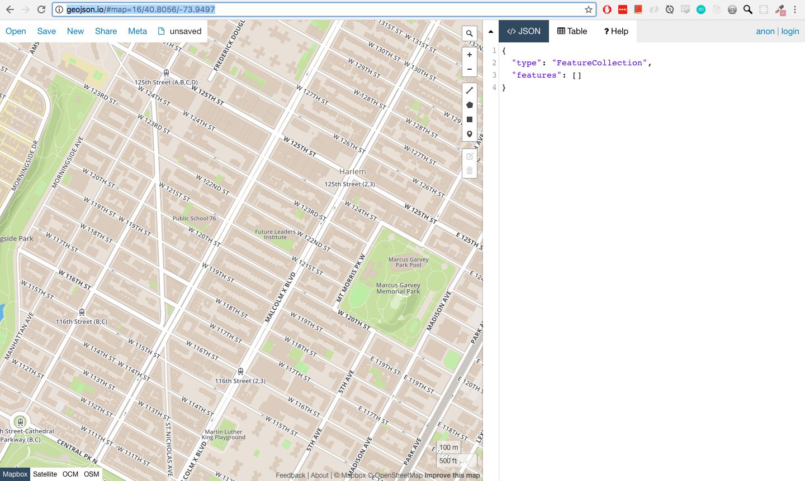
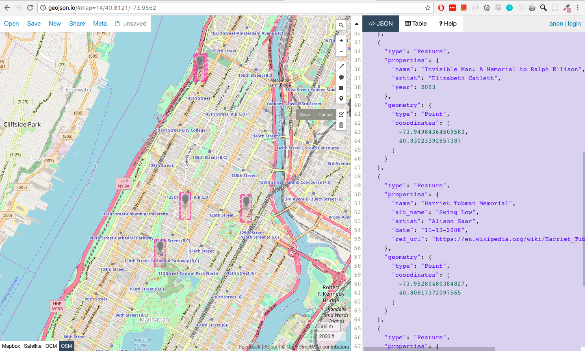
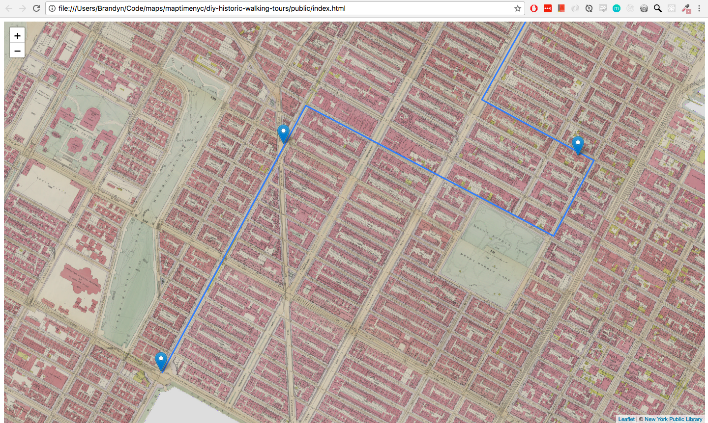

##  Step 4 - Add Walking Tour Layers  

Next we will create our walking tour data and add it to our map.  

### GeoJSON  
GeoJSON is a data format that is widely used for geographic data on the web.  It is a specific form of a JSON (JavaScript Object Notation).  This means it is just a JSON with a standard set of keys that allow clients (like Leaflet) to read & parse.  GeoJSON is formatted like this:  

```JSON
{
  "type": "Feature",
  "geometry": {
    "type": "Point",
    "coordinates": [-73.96299451589584, 40.809836408488124]
  },
  "properties": {
    "name": "The Diana Center",
    "address": "3009 Broadway, New York NY 10027"
  }
}
```
See [geojson.org](http://geojson.org/) or Tom MacWright's blog post [here](https://macwright.org/2015/03/23/geojson-second-bite#coordinate) for more details about the specification.  

---
### Creating GeoJSON Data  
There are many ways to create our own geographic data.  We could use desktop GIS, such as QGIS, or we could use web tools like CARTO, which stores data in a spatial database and provides an API for getting GeoJSON our of the db.  For this tutorial, we're going to use the easiest route and digitize our features in [GeoJSON.io](http://geojson.io/#map=16/40.80558317487379/-73.94968271255495).  
  

**Points**  
Start with the points of interest for your tour by clicking the "Draw a Marker" button.  After marking the geographic location of your POI, use the "Edit layers" button to click on your new point and add attribute information.  GeoJSON allows us to use any key:value pairs that make sense for the data.  

After saving, you will see the data in GeoJSON form in the right panel.  I recommend removing the rows for `marker-color`, `marker-size`, and `marker-symbol` because we will use Leaflet for styling our GeoJSON.  Here's an example of a finished point layer:  



Create a new file, `points.geojson`, and paste the text from geojson.io into your new blank file.  We'll use this for our walking tour map.  

Repeat the same process with the line editing tool, and save that in a file called `path.geojson`.  

Example files that you can use for this tutorial are found in `./data/points.geojson` and `./data/path.geojson`, but you are encouraged to create your own walking tour!  

---
### Adding GeoJSON in Leaflet  

Like we added our `tileLayer`, Leaflet provides convenient methods for adding geojson data, called `geoJSON()`.  

Open your `map.js` file for the following steps.  

- **Load your data into the map**  
  There are a few strategies for doing this.  Typically you would load your data from an external file (like they are stored in `./data/` currently), or you would make a request to an API to get geojson data dynamically.  We are going to follow the simplest route - storing them directly in our JS as variables.  

```js
/** public/map.js **/

//  put this below your L.tileLayer code
var points = //  paste your ./data/points.geojson here, including the {}
var path = // paste your ./data/path.geojson here, including the {}
```  

We can now refer to our geojsons in our JS code as simply `point` and `path`.  

- **Call L.geoJSON()**  
This is very similar to how we added a tileLayer, but using our geojsons (stored as variables), and the geoJSON() method.

```js
/** public/map.js **/

//  put this below your points and path variable declarations
//  add the path layer  
L.geoJSON(path).addTo(map);
//  add the point layer
L.geoJSON(points).addTo(map);
```  

Refresh your map and behold:
  

See `4-add-walking-tour-geojson-SOLUTION` for a walking tour map with point and path added.
