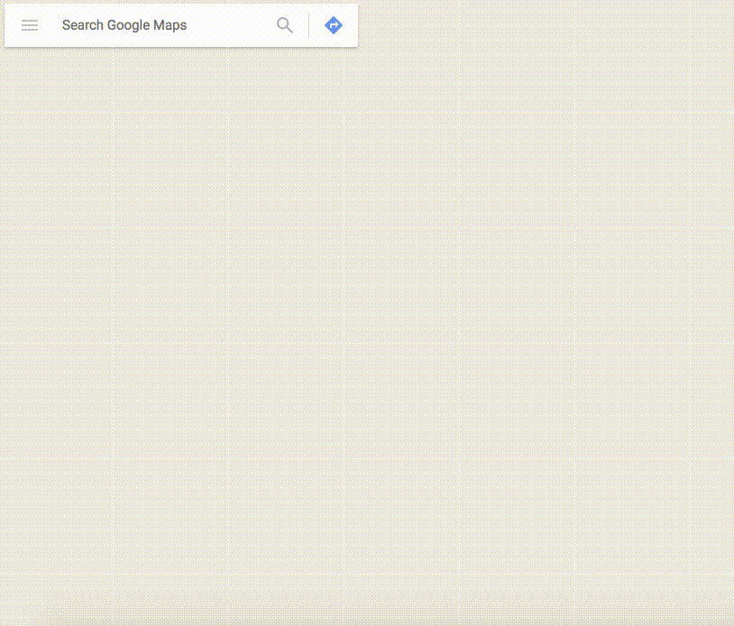
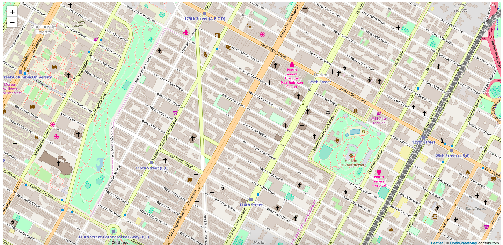
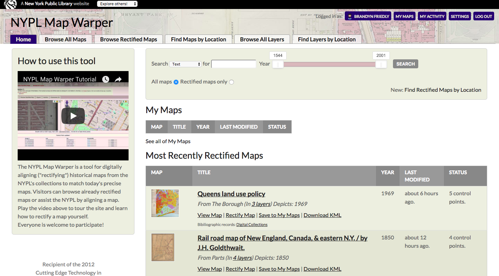
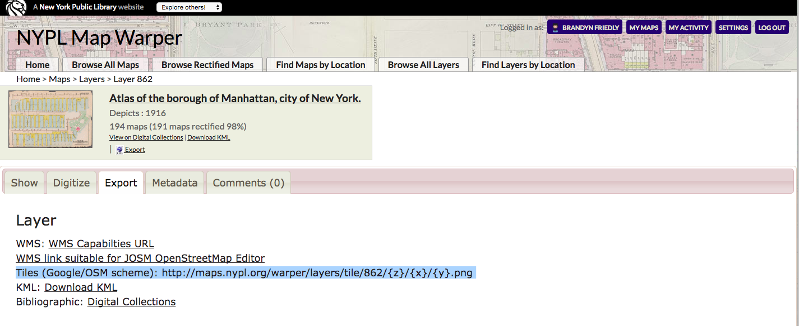
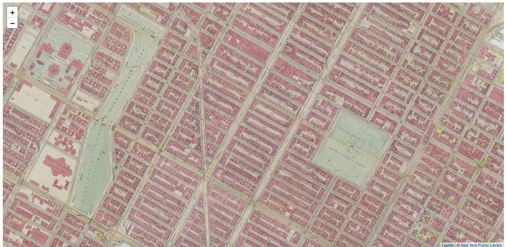

##  Step 3 - Add NYPL Space/Time Basemap  

Technically we now have a map (by Leaflet's standards).  Cartographers, however, might take issue with our "map" because there's no map data!

Let's make our map more interesting by adding a basemap from NYPL's digital map collection.  

First, let's learn how to add a basemap to our Leaflet map.  Then we'll find an appropriate one from NYPL's Space/Time Directory.
___  
**Note about basemaps:**  A challenge in web mapping is how to load all the data that is required to show maps at different parts of the world and at different scales (zoom levels).  It's impossible to send all the data to the browser at once.  We also don't know how a user will use the map.  We don't want to send them data for an area or zoom that they never even try to look at.  

The solution for this problem of web mapping is to cut data into **tiles**.  You may seen this in action if you've tried to view a map with slow internet connection.
  

When we are panning or zooming on a map, the map client (Leaflet, OpenLayers, Google Maps) is constantly sending requests to a **tile server** to tell it which data we want to look at.  The tile server responds with all the tiles that we need to view the data.  

### Add a Basemap  

Leaflet makes it easy for us to add a tile layer to our map with its `tileLayer` method.  

Add the following at the bottom of your JavaScript to add a tile layer using [OpenStreetMap](https://www.openstreetmap.org/#map=16/40.8093/-73.9540)'s tile server:

```js
/** public/map.js **/

// Add a tile layer from OpenStreetMaps tile server
// Pass a configuration object {} for attribution
L.tileLayer('http://{s}.tile.osm.org/{z}/{x}/{y}.png', {
    attribution: '&copy; <a href="http://osm.org/copyright">OpenStreetMap</a> contributors'
}).addTo(map); // this .addTo() syntax is called "method chaining".  It performs a function from the result of the previous function - L.tileLayer()
```
If you save `map.js` and refresh your webpage you should see this:

---
###  Navigating NYPL's Space/Time Directory  

To browse NYPL's digital map collections head over to [Map Warper](http://maps.nypl.org/warper/).  Map Warper is a:
> "...tool for digitally aligning ("rectifying") historical maps from the NYPL's collections to match today's precise maps. Visitors can browse already rectified maps or assist the NYPL by aligning a map. "  

  

With Map Warper, we can browse all maps or ones that volunteers have already georeferenced for us.  We can also search the collections by _Layers_ , maps from the same atlas stitched together.  Let's "Find Layers by Location" for our basemap.  

  

After clicking "Open Layer" on a layer of your choice, we are greeted with a few powerful tools.  We can browse the map, digitize features, and view detailed information about the atlas.    

To use this layer in our custom application, we're interested in the _Export_ panel.  Among the many options for using this layer, one in particular is helpful for our Leaflet map:


That URL should look familiar.  Try replacing the OSM URL in `map.js` with the tiles URL in Map Warper.  Also Refresh your map to see Harlem in 1916.  
  

We just made a web map with an atlas from 1916 in 9 lines of code.  Thank you Leaflet and NYPL!  

See `3-add-nypl-basemap-SOLUTION` for the changes we made to `map.js`.  
