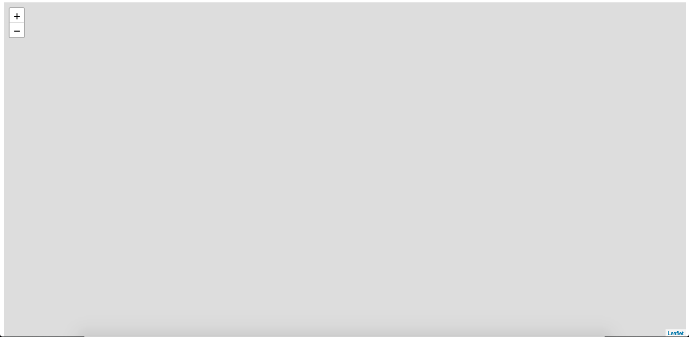

##  Step 2 - Instantiate Leaflet   

We will use Leaflet to create our walking tour map.  [Leaflet](http://leafletjs.com/) is a lightweight & powerful JavaScript library used to make interactive web maps.  

  

Just like we told the browser that our web page relies on our local style and script (`./public/style.css` & `./public/map.js`), we need to tell the browser to load Leaflet.  
___
**Add Leaflet.css and Leaflet.js**  
Open your index.html.  Add Leaflet's CSS above the `<link>` for your `style.css`:  
```html
<!-- public/index.html -->
...
  <!-- Load Leaflet Styles to get nice default styles for our map components -->
  <link rel="stylesheet" href="https://unpkg.com/leaflet@1.2.0/dist/leaflet.css"
  integrity="sha512-M2wvCLH6DSRazYeZRIm1JnYyh22purTM+FDB5CsyxtQJYeKq83arPe5wgbNmcFXGqiSH2XR8dT/fJISVA1r/zQ=="
  crossorigin=""/>
  <!-- Load our style -->
  <link rel="stylesheet" href="./style.css">
</head>
...
```

Similarly, add Leaflet's JS above your `<script>` element for `map.js`:  
```html
<!-- public/index.html -->
...
  <!-- Load the Leaflet JavaScript Library! -->
  <script src="https://unpkg.com/leaflet@1.2.0/dist/leaflet.js"
  integrity="sha512-lInM/apFSqyy1o6s89K4iQUKg6ppXEgsVxT35HbzUupEVRh2Eu9Wdl4tHj7dZO0s1uvplcYGmt3498TtHq+log=="
  crossorigin=""></script>
  <!-- Load our JavaScript -->
  <script src="./map.js" charset="utf-8"></script>
</body>
...
```  

_Note: the order we load the JS files matters!  We need Leaflet.js to be loaded before our map.js so our code has access to Leaflet's methods._  
___
**Create a Leaflet Map**  
Create a `<div>` element in our html to hold the map:  
```html  
<!-- public/index.html -->
...
<body>
  <!-- We tell Leaflet.js to mount our map to this HTML element -->
  <div id="map">
  </div>
...
```  

Style the `<div>` to give it height and width:  
```css
/* public/style.css */
#map {
  height: 99vh;
  width: 99vw;
}
```  
The `vh` and `vw` are size units that refer to the viewport height and viewport width.  The viewport is the "user's visible area of a web page" [W3Schools](https://www.w3schools.com/css/css_rwd_viewport.asp), and is very useful for sizing our map responsively to the size of the browser.  

Next, in our JavaScript we will instantiate our map:  
```js
/** public/map.js  **/

// Initialize a Leaflet map and store a reference to the map Object
var map = L.map('map')

//  Set the [lat, long], and zoom for the map using Leaflet's setView method
map.setView([40.80558317487379, -73.94968271255495], 16)
```

Open your index.html in a web browser, and behold your beautiful Leaflet map:
  

If you are stuck, ask a neighbor or check out the `2-instantiate-leaflet-SOLUTION` branch
