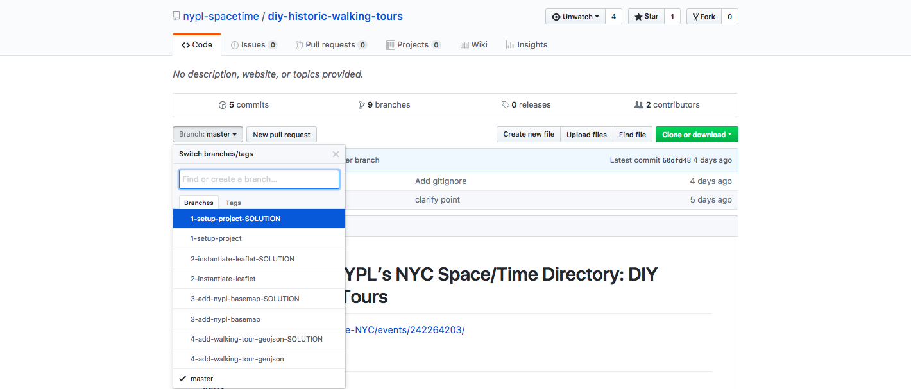
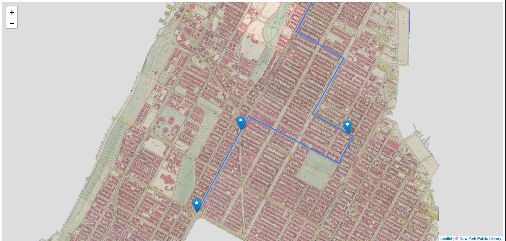

# MaptimeNYC + NYPL’s NYC Space/Time Directory: DIY Historic Walking Tours

https://www.meetup.com/Maptime-NYC/events/242264203/

**October 19th, 2017**

### About  
This repository contains all the code used for the workshop _MaptimeNYC + NYPL's NYC Space/Time Directory:  DIY Historic Walking Tours_ in partnership with Barnard College.  

The workshop is a beginner-friendly introduction to using Leaflet for web maps and accessing the NYC Space/Time Directory.  

The workshop is organized by git branches.  In Github you can browse all branches by clicking on the "branch" button.  
  

The following branches take you through each step in making a historical walking tour map:  
-  1-setup-project
-  2-instantiate-leaflet
-  3-add-nypl-basemap  
-  4-add-walking-tour-geojson  

You are encouraged to try each step on your own, using the README.md to guide you.  If you get stuck at any step, you can switch to the "SOLUTION" branch for any step to get help.  

By the end of the tutorial you will have made your own walking tour using historical data from NYPL's Digital Collections.  Here is an example of a walking tour we'll be making together:  

### Resources  
[NYC Space/Time Directory](http://spacetime.nypl.org/)  
[Leaflet.js Documentation](http://leafletjs.com/)  
[Geosandbox (great tool for experimenting with Leaflet)](https://joeyklee.github.io/geosandbox/)  
[Anatomy of a Web Map](http://maptime.io/anatomy-of-a-web-map/)  
[Cartography Guide by Axis Maps](http://www.axismaps.com/guide/)
